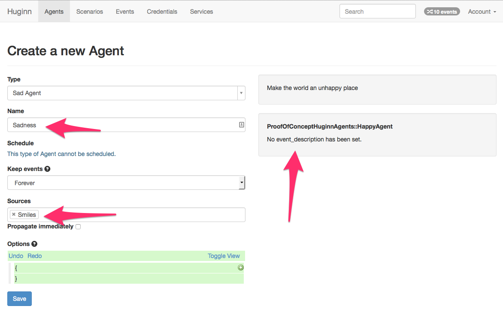

# HuginnAgent

[](https://travis-ci.org/darrencauthon/huginn_agent)
[](https://codeclimate.com/github/darrencauthon/huginn_agent)

A base agent that you can use to create your own Huginn agents.

These gems can be in their own separate gem, without any tie to Huginn.

When you start your Huginn application with this gem installed, any
```HuginnAgent``` classes you defined will be incorporated into
your Huginn application automatically.

## Installation

Add this line to your Huginn app's Gemfile:

```ruby
gem 'huginn_agent'
```

And then execute:

    $ bundle

Now inside your Huginn app, create ```config/initializers/huginn_agent.rb``` with
the following:

```ruby
require 'huginn_agent'
HuginnAgent.hack_huginn_to_accept_me
HuginnAgent.types.each { |t| t.emit }
```


## Creating an agent

Here's the simplest HuginnAgent:

```ruby
class Happy < HuginnAgent
end
```

When you inherit from ```HuginnAgent```, your agent will automatically be recognized.  You just have to get it into your web application, somehow. Here are a couple possibilities:

  1) Put your agent in a gem.  Then add a link to the gem in your Huginn app's Gemfile.
  2) Put the agent in your Huginn app. 

*Note: Rails may not load the Ruby file unless it sees some sort of hard reference to the file. (go figure?) If your agent isn't loaded, try referencing it in your initializer: *

```ruby
require 'huginn_agent'

Happy # <== now Rails will look at models/happy.rb, thanks Rails

HuginnAgent.hack_huginn_to_accept_me
HuginnAgent.types.each { |t| t.emit }
```

However you choose to load this agent, it will be made available as ```HappyAgent``` in your list of available agents.


But what does it do?  We should add an agent description so others will know.

```ruby
class Happy < HuginnAgent

  def self.description
    'Make the world a happy place'
  end

end
```


That's good... but does our agent really make the world a better place? It looks like it does nothing to me.

Let's make it do something.

### Checking for Anything

Let's start by adding a ```check``` method.  This method will be called whenever the agent is scheduled to run.

```ruby
class Happy < HuginnAgent

  def self.description
    'Make the world a happy place'
  end

  def check
  end

end
```

Adding this method opens the ability to schedule the agent. Whenever the agent is scheduled to run, the ```check``` method will be run.


### Creating Events

Our ```HappyAgent``` can be scheduled, but it still doesn't do anything. Let's have it blast a ray of sunshine... in the form of an event.

```ruby
class Happy < HuginnAgent

  def self.description
    'Make the world a happy place'
  end

  def check
    create_event payload: { blast: 'A ray of sunshine' }
  end

end
```

So I'll create the agent, name it "Smiles", and schedule it to run every minute. Look at it go!


If this agent was tasked with things more complicated than basic happiness, I could put all sorts of custom logic in this method to look up stuff, parse results, and create fancier events.

### Receiving Events

So agents don't have to just create events, they can also receive them.  Let's go to the dark side and create a Sad Agent, which will watch out for those happy events and make them sad.

Since this agent will be receiving events, we'll need to add a ```receive``` method with one ```events``` argument. 
This method will be passed any events the agent is subscribed to.

```ruby
class Sad < HuginnAgent

  def self.description
    'Make the world an unhappy place'
  end

  def receive events
  end

end
```


Let's create an agent that will receive the events from the "Smiles" Happy Agent we created, and turn them into sadness.

```ruby
class Sad < HuginnAgent

  def self.description
    'Make the world an unhappy place'
  end

  def receive events
    events.each do |event|
      if event.payload['blast']
        event.payload['blast'].gsub! 'sunshine', 'darkness'
        create_event payload: event.payload
      end
    end
  end

end
```



Now whenever the "Smiles" agent fires an agent, the Sadness agent will pick it up and corrupt its positive message blast.


### Everything else

Creating and receiving events are the core features of Huginn. But there are many more, and most are supported by this gem.

Let's start with ```event_description```. Did you notice how the Sad agent reported that "No event_description has been set" for the Happy agent? Let's fix that.

```ruby
class Happy < HuginnAgent

  # all of that stuff from above ^^^

  def self.event_description
<<TEXT
These events always look like:

```
{ blast: 'A ray of sunshine' }
```
TEXT
  end

end
```


Let's try some others, like managing the agent options.

```ruby
class Happy < HuginnAgent

  # all of that stuff from above ^^^

  def default_options
    {
      important_api_key: ''
    }
  end

  def validate_options
    errors.add :base, 'you must provide the Important API Key' if options['important_api_key'].to_s.strip == ''
  end

end
```


Huginn allows agents to have a ```working?``` flag, which is helpful when determining if an agent is working as expected.  Your agent will default to true, but you can change that:

```ruby
class Sad < HuginnAgent

  # the stuff from above ^^^

  def working?
    false
  end

end
```


### Interacting with Native Huginn Agent stuff

Your agents built on this gem aren't actually native Huginn Agents.  That's because the Agent base class is in a Rails application, and it won't work outside of that Rails application.

This gem provides you with a base class that will "project" your agent into this Rails environment.  This makes it extendable, but it also means that you're not working with Huginn Agents directly.

But it still works.  Any methods you call from agents written from this gem are routed to the native Huginn code, so you can use the same methods.  ```options```, ```memory```, ```log```, etc.  They all still work.

## Contributing

1. Fork it ( https://github.com/[my-github-username]/huginn_agent/fork )
2. Create your feature branch (`git checkout -b my-new-feature`)
3. Commit your changes (`git commit -am 'Add some feature'`)
4. Push to the branch (`git push origin my-new-feature`)
5. Create a new Pull Request
